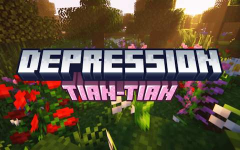

# Depression-TianTian

语言：**| [English](README.md) | > 简体中文 < |**

## 📌 前置

需要Fabric API、Architectury、Depression作为前置。

规划联动起源，规划兼容AppleSkin。

## 📑 介绍

Depression-TianTian（以下简称本模组）是一个扩展抑郁症（Depression）模组（以下简称原版模组）的模组。

修改了原版模组的一部分内容，增加了更多可配置选项，最重要的是增强了日记系统，也可以作为一个库模组供其它创作者使用。

### 💖 对于玩家

它的诞生原因之一是我认为原版模组的日记内容太少了，文案表演感太重，总之我“报复性”地添加了大量日记内容。

除此之外的内容请查看详细介绍：

- 增强的日记生成系统：通过玩家行为数据总结和生成更丰富和个性化的日记内容。
- 增加了更多提示文本：增加沉浸感和新奇感。
- 使躯体化症状更明显：如模拟厌食症状，使饥饿值状态栏消失。
- 提供更多可配置选项：如禁用精神特质选择界面，修改心理医生的商品价格等。
- 提供游戏性保护机制：如当玩家双脚离地时自动阻止闭眼等。
- （规划）允许玩家自残以提高情绪值：危险内容，频繁自残可能导致玩家死亡。
- 增加了更多恢复情绪和精神健康值的方法。

### 🗺️ 对于其它创作者

这也是一个让原版模组的代码变得更易用的库模组，提供了较丰富的事件和包装类。

另外其实还有一个原因，虽然原版模组显然不是面向整合包的，但保不齐哪天就有人想要做一个这样的整合包了呢？

本模组对日记系统做了系统性重构，可以更容易地添加或修改其中的内容，如果你想要这么做，请查看[WIKI页面](https://github.com/GRAINALCOHOL/depression-tiantian/wiki)

## 💭 FAQ

Q: 其它 Minecraft 版本？
A: 目前没有这样的打算，但鼓励第三方移植。

Q: Forge/neoForge/Quilt 版本？
A: 目前没有这样的打算，但鼓励第三方移植。

## ℹ️ 其它 & 鸣谢

Depression作者：[Block-137（MC百科）](https://www.mcmod.cn/author/32591.html)。

美术资源：[食猫兽杨子默（MC百科）](https://www.mcmod.cn/author/32592.html)。

文案贡献者：[泡芙Orz（MC百科）]()、[李天昊（MC百科）](https://www.mcmod.cn/author/33502.html)、[ki_ecao（MC百科）]()。

模组名字来源于一首音乐：[TIAN TIAN](https://music.163.com/song?id=2707332868)。