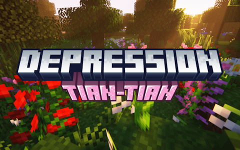

# Depression-TianTian

Language: **| >English< | [简体中文](README-zh_cn.md) |**

## 📌 Prerequisites

Requires Fabric API, Architectury, and Depression as dependencies.

Planned integration with Origins, planned compatibility with AppleSkin.

## 📑 Introduction

Depression-TianTian (hereinafter referred to as this mod) is a mod that extends the Depression mod (hereinafter referred to as the original mod).

It modifies some content of the original mod, adds more configurable options, and most importantly, enhances the diary system. It can also serve as a library mod for other creators.

### 💖 For Players

One of the reasons for its creation is that I felt the original mod's diary content was too limited and the writing felt too performative. So I "retaliatively" added a large amount of diary content.

For other content, please check the detailed introduction:

- Enhanced diary generation system: Summarizes and generates richer, personalized diary content through player behavior data.
- Added more hint texts: Increases immersion and novelty.
- Makes somatic symptoms more obvious: Such as simulating anorexia symptoms by making the hunger status bar disappear.
- Provides more configurable options: Such as disabling the mental trait selection interface, modifying psychiatrist item prices, etc.
- Provides gameplay protection mechanisms: Such as automatically preventing eye closure when the player's feet are off the ground, etc.
- (Planned) Allows players to self-harm to increase mood value: Dangerous content, frequent self-harm may lead to player death.
- Added more ways to recover mood and mental health values.

### 🗺️ For Other Creators

This is also a library mod that makes the original mod's code easier to use, providing rich events and wrapper classes.

Additionally, there's another reason: although the original mod is obviously not designed for modpacks, who knows if someone might want to create such a modpack someday?

This mod has systematically refactored the diary system, making it easier to add or modify content. If you want to do this, please check the [WIKI page](https://github.com/GRAINALCOHOL/depression-tiantian/wiki)

## 💭 FAQ

Q: Other Minecraft versions?
A: Currently no plans, but third-party ports are encouraged.

Q: Forge/NeoForge/Quilt versions?
A: Currently no plans, but third-party ports are encouraged.

## ℹ️ Other & Credits

Depression author: [Block-137 (MC百科)](https://www.mcmod.cn/author/32591.html).

Art resources: [食猫兽杨子默 (MC百科)](https://www.mcmod.cn/author/32592.html).

Text contributors: [泡芙Orz (MC百科)](https://www.mcmod.cn/author/40349.html), [李天昊 (MC百科)](https://www.mcmod.cn/author/33502.html), [ki_ecao (MC百科)](https://www.mcmod.cn/author/40348.html).

The mod name comes from a piece of music: [TIAN TIAN](https://music.163.com/song?id=2707332868).